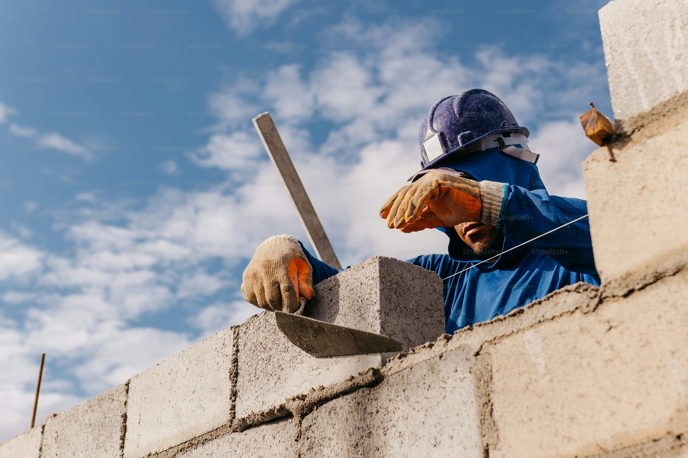

[index.html](https://github.com/user-attachments/files/24756631/index.html)
<!DOCTYPE html>
<html lang="cs">
<head>
<meta charset="UTF-8">
<meta name="viewport" content="width=device-width, initial-scale=1.0">
<title>J&T Stavebnictví</title>

</head>
<body>

<!-- Horní pruh s logem -->

    

<!-- Menu -->
<nav>
    <a href="#about">O nás</a>
    <a href="#services">Služby</a>
    <a href="#references">Reference</a>
    <a href="#extra-services">Další služby</a>
    <a href="#contact">Kontakt</a>
</nav>

<!-- O NÁS -->
<h2 class="about-title">O NÁS:</h2>

J&T Stavebnictví působí na trhu již mnoho let a získala si reputaci díky kvalitě, spolehlivosti a osobnímu přístupu ke každému klientovi. Naše specializace zahrnuje kompletní realizace cihlových domů, rekonstrukce, zateplení a fasády, přičemž vždy dbáme na detail a estetický vzhled.

Náš tým tvoří zkušené zedníky a stavební odborníky, kteří kombinují tradiční řemeslnou dovednost s moderními stavebními technologiemi. Každý projekt je pro nás unikátní a přistupujeme k němu s maximální pečlivostí, aby výsledná stavba splňovala nejvyšší standardy kvality a bezpečnosti.

Naším cílem je spokojený zákazník – proto dbáme nejen na precizní provedení, ale i na rychlost a efektivitu prací. Spolu s vámi plánujeme a realizujeme každý projekt od prvotního návrhu až po finální dokončení, abyste se mohli těšit z nového či zrekonstruovaného domu, který vydrží generace.

<!-- Fotky služeb -->

<h2 class="section-title">Služby</h2>

    

        
        <h3>Co děláme</h3>
        
Zateplení, stavby domu, rekonstrukce, novostavby, fasády

    

    

        
        <h3>Na trhu</h3>
        
Již několik let poskytujeme kvalitní stavební služby s maximální spokojeností zákazníků

    

    

        
        <h3>Naše služby</h3>
        
Novostavby a rekonstrukce cihlových domů s profesionálním zateplením a fasádou

    

<!-- Červený blok Reference – přes celou šířku -->

Reference – viz naše realizace

<!-- Extra služby (6 bloků) -->

<h3>STAVEBNÍ PRÁCE & VÝSTAVBY</h3>

Komplexní stavební služby od projektu až po dokončení. Novostavby, rekonstrukce, dokončovací práce.

<ul>
<li>Výstavbu rodinných domů a přestavby budov</li>
<li>Základová deska</li>
<li>Izolace domu proti vlhkosti</li>
<li>Půdní výstavby</li>
</ul>

<h3>REKONSTRUKCE & REVITALIZACE</h3>

Proměňte svůj dům nebo byt s našimi profesionálními rekonstrukcemi a revitalizacemi.

<ul>
<li>Rekonstrukce bytů</li>
<li>Rekonstrukce rodinných domů</li>
<li>Rekonstrukce komerčních staveb</li>
<li>Rekonstrukce bytových jader</li>
<li>Rekonstrukce chat a chalup</li>
</ul>

<h3>ZEDNICKÉ PRÁCE</h3>

Odborné provádění zednických prací od opravy zdí až po jejich výstavbu.

<ul>
<li>Štukování, omítání a oprava zdí a stěn</li>
<li>Natažení stěn lepidlem s perlinkou</li>
<li>Průmyslové betonové podlahy a nivelace</li>
<li>Zdění z cihel a tvárnic</li>
<li>Dekorativní a betonové štěrky</li>
</ul>

<h3>SÁDROKARTONÁŘSKÉ PRÁCE</h3>

Sádrokartonové práce pro profesionální vzhled interiéru - od instalace až po finální úpravy.

<ul>
<li>Sádrokartonové podhledy</li>
<li>Sádrokartonové příčky</li>
<li>Sádrokartonové předstěny a kastlíky</li>
<li>Sádrokartonové kazetové podhledy</li>
</ul>

<h3>DEMOLIČNÍ PRÁCE</h3>

Nabízíme kompletní řešení - od bourání až po konečné odstranění.

<ul>
<li>Bourací práce a vyklízení</li>
<li>Demolice</li>
<li>Zemní a výkopové práce</li>
<li>Likvidace odpadů a sutí</li>
</ul>

<h3>DRENÁŽE & ODVODNĚNÍ</h3>

Drenáže a odvodnění jsou klíčovým faktorem pro udržení sucha a stability ve vaší stavbě. S pečlivým přístupem a důrazem na efektivitu provedu drenážní opatření, která zajistí odpovídající odvodnění a ochranu vaší konstrukce před vlhkostí.

<!-- Kontaktní sekce s doporučením -->

  

    

      
★★★★★

      

      

      

        <button onclick="showRec(0)">1</button>
        <button onclick="showRec(1)">2</button>
        <button onclick="showRec(2)">3</button>
      

    

  

  

    <h2>Kontaktujte nás</h2>
    <form id="contactForm" action="https://formspree.io/f/xlggedqz" method="POST">
      <input type="text" name="name" placeholder="Vaše jméno" required>
      <input type="email" name="email" placeholder="Váš email" required>
      <input type="text" name="phone" placeholder="Telefon">
      <textarea name="message" placeholder="Vaše zpráva" rows="6" required></textarea>
      <button type="submit">Odeslat zprávu</button>
    </form>
  

<!-- Mapa -->

<iframe src="https://www.google.com/maps?q=Jana+Žižky+349,+Telč&output=embed"></iframe>

<!-- Footer -->

©2026 Zednické práce J&T Stavebnictví | Všechna práva vyhrazena | Osoba zapsána v živnostenském rejstříku | IČ: 60542918 | <a href="gdpr.html">GDPR</a>

</body>
</html>
